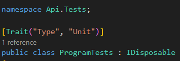

# Template repository for .Net microservices

## Overview
This repository contains:
- Standardised file structure for mono-repo
- Integration with Docker CI/CD pipeline templates
- Local environment with:
  - Containers for your microservices
  - MongoDb with a 1 node replica set
  - Redis
  - Kafka
  - GUI for MongoDb
  - GUI for Redis
  - GUI for Kafka
- Scripts to:
  - Interact with the local environment
  - Run automated tests
  - Run the build process

## How to use

### Create a repository from this template
When creating your repository on Github, choose the repository named `pt.technology.templates.dotnetMS` from the list identified in the image below.


### Instructions
- Create your services inside the `src` directory
- Run automated tests with `sh cli/test.sh` (more [details](#automated-tests))
- Run the local environment with `sh cli/start.sh` (more [details](#local-environment))
- Stop the local environment with `sh cli/stop.sh`
- Build your services with `sh cli/build.sh`

### One time setup
When you first create your repository do the following one time setup:
- Rename the `my_app.sln` .Net solution file
- If needed, copy the file `setup/local/.env.template` to `setup/local/.env` and fill in your values
- Create the environment variables and secrets, in your repository, required by the [CI and CD pipeline templates](https://github.com/CorreiosPortugal/pt.technology.pipeline-templates.actions/blob/main/docs/docker.md)
- Replace the `Api` service and it's unit test suite

### Local environment
#### Start the local environment
To start the local environment run the command, from the root of the repository
```sh
sh cli/start.sh [docker flags] [services]
```
Where:
- docker flags: Any flag supported by the docker compose cli "up" command.<br>EX: `sh cli/start.sh -d` to start the local environment in the detach mode
- services: Whitespace separated list of services to start. If none are provided, all services will be started.<br>Ex: `sh cli/start.sh api` to start only the "api" service and all services it depends on.

#### Stop the local environment
To stop the local environment run the command, from the root of the repository
```sh
sh cli/stop.sh
```

#### What is available
- **MongoDb GUI:** [http://localhost:9000](http://localhost:9000)
- **Redis GUI:** [http://localhost:9001](http://localhost:9001)
- **Kafka GUI:** [http://localhost:9002](http://localhost:9002)
- **Api test GET endpoint:** [http://localhost:10000](http://localhost:10000)

### Automated tests
To run the automated tests use the following command, from the root of the repository
```sh
sh cli/test.sh [flags] [projects]
```
Where:
- flags:
  - `-w` or `--watch`: Run the tests in watch mode
  - `--docker`: Run the tests inside a Docker container
  - `--cicd`: Run the tests with CI/CD pipeline considerations
  - `--filter`: Run the tests that match the provided [filters](https://learn.microsoft.com/en-us/dotnet/core/testing/selective-unit-tests?pivots=xunit)
  - `--unit`: Run the tests flagged as unit tests
  - `--integration`: Run the tests flagged as integration tests
  - `--e2e`: Run the tests flagged as end-to-end tests
- projects: Whitespace separated list of .Net projects to test. If none are provided, all .Net projects declared in the .Net solution will be tested.<br>Ex: `sh cli/test.sh --unit test/unit/Api.Tests/Api.Tests.csproj` to run only the unit tests for the "api" service.

#### Flagging tests as unit, integration or end-to-end
All test suites should have one of the following traits:
- `Unit`
- `Integration`
- `E2E`

